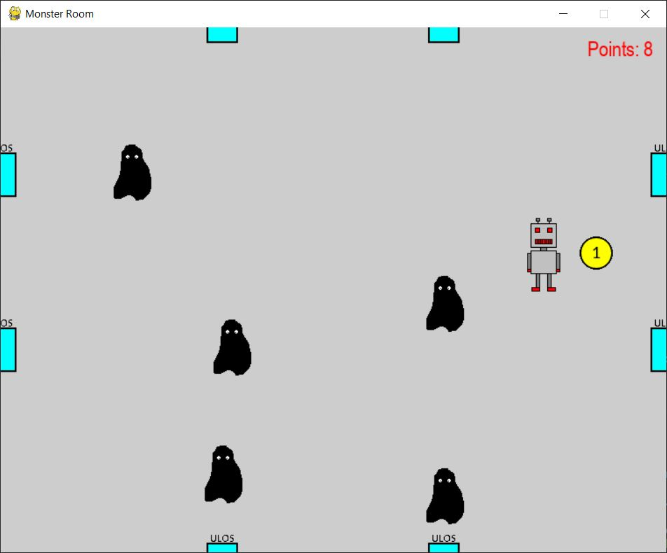
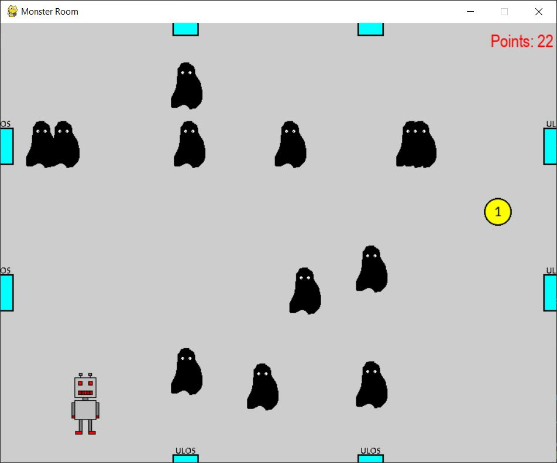
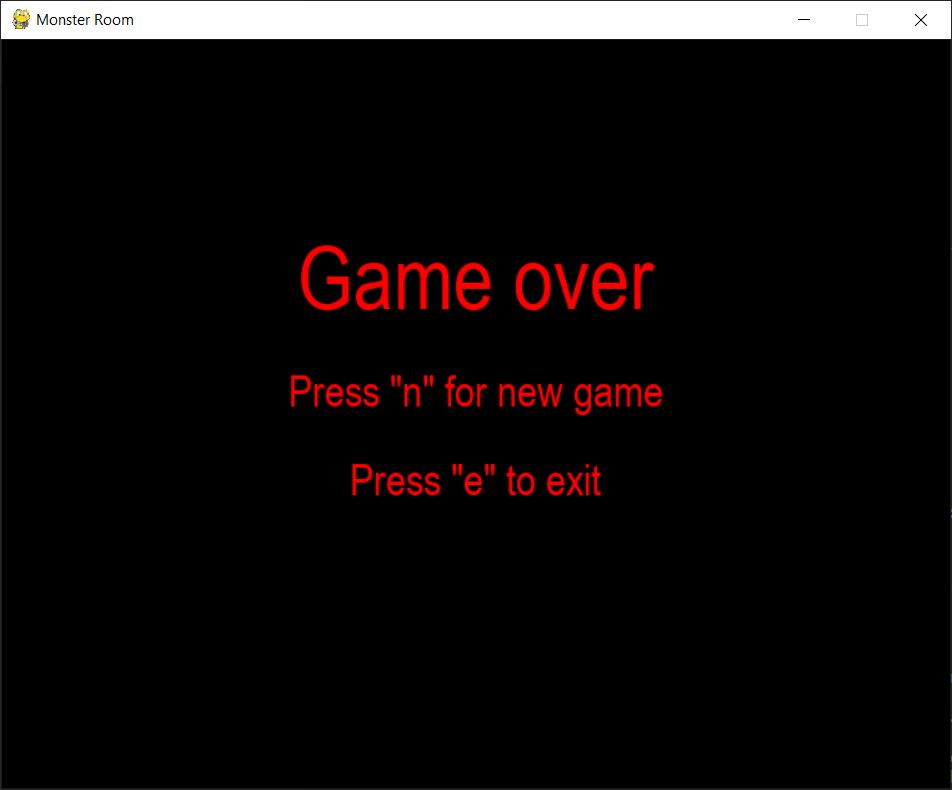

# pygame-Monster Room
"Monster Room" is a small game made in Python using the pygame library and OOP. 

## Game Description
The game involves the player (the robot sprite) trying to score points by collecting a coin which randomly changes it's coordinates when touched by the player. In the meantime, monster sprites are coming from the left and upper portals. If the player touches the monsters, the player loses. The monsters come with increasing frequency and increasing speed depending on the number of points the player has scored.
After scoring 10 points a "hunter" is spawned in the right bottom corner represented by a slow moving monster sprite that follows the player. If touched, it also leads to a loss for the player. 
The game also features a game over screen and 2 options after losing, to start a new game or exit.

The game was made as the last project of the MOOC.fi python advanced programming course offered by the Department of Computer Science at the University of Helsinki.

## Game Screenshots
A game state at the beginning of the game when monsters are spawning rarely and the "hunter" hasn't spawned.

A game state after the player has scored more points when the monsters are spawning more frequently and the "hunter" that follows the player has spawned.

The game over screen

## Technologies
* Python 
* Pygame library
* Git
